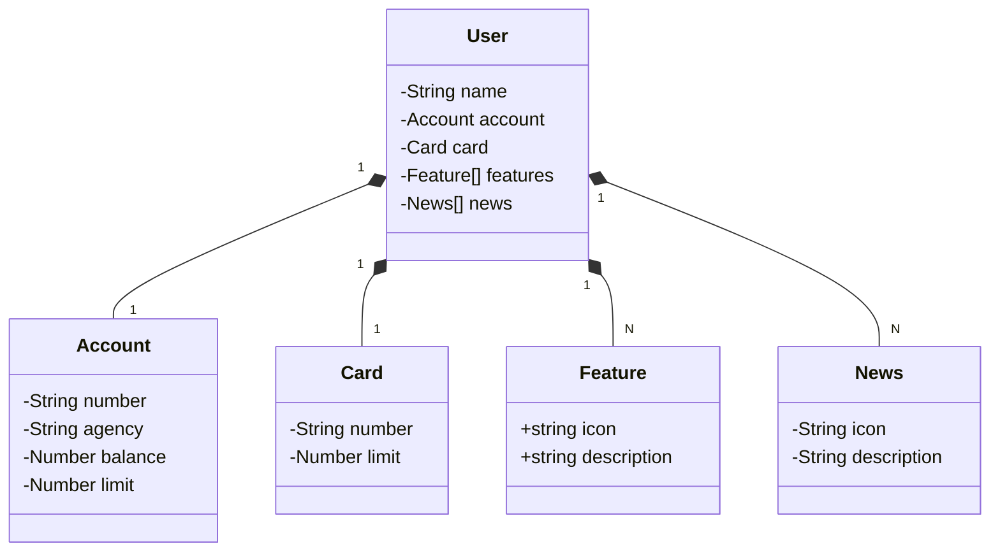

# Santander Dev Week 2025
Java RESTful API criada para o Santander Dev Week.

## Diagrama de classes

```mermaid
classDiagram
    class User {
        -String name
        -Account account
        -Card card
        -Feature[] features
        -News[] news
    }

    class Account {
        -String number
        -String agency
        -Number balance
		-Number limit
    }

    class Feature {
        +string icon
        +string description
    }

    class Card {
        -String number
        -Number limit
    }

    class News {
        -String icon
        -String description
    }

    User "1"*-- "1"Account
    User "1"*--"1"Card
    User "1" *-- "N"Feature
    User"1" *-- "N" News

```

